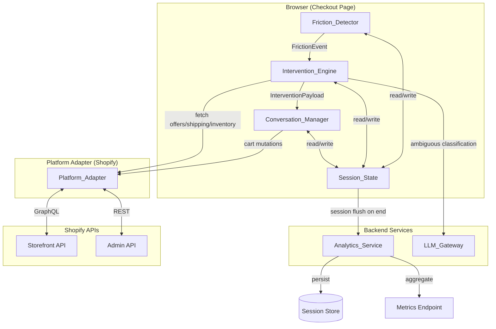
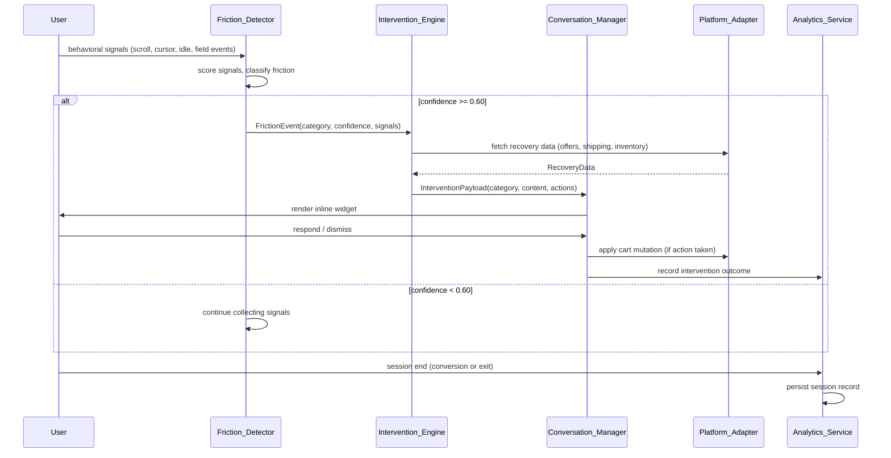
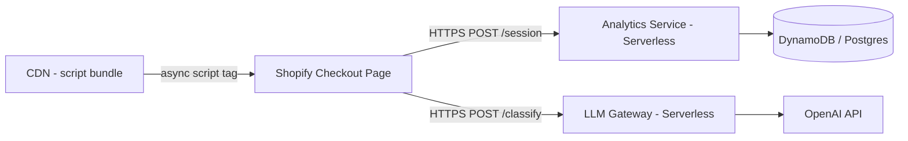

# Design Document: AI-Assisted Checkout Recovery

## Overview

The AI-Assisted Checkout Recovery system is a client-side behavioral intelligence layer that integrates with Shopify-compatible e-commerce checkouts. It detects friction in real-time, classifies the abandonment cause, and delivers targeted conversational interventions inline — without redirecting the user or blocking checkout progress.

The system is composed of three primary runtime components — **Friction_Detector**, **Intervention_Engine**, and **Conversation_Manager** — plus a server-side **Analytics Service** for session outcome persistence and metrics aggregation. A thin **Platform Adapter** layer abstracts Shopify-specific API calls so the core logic remains platform-agnostic.

### Design Goals

- **Non-blocking**: The system must never prevent a user from completing checkout. Every component degrades gracefully.
- **Low latency**: Friction classification must complete within 2 seconds; UI responses within 1 second.
- **Minimal footprint**: The client-side bundle must not increase page load time by more than 200ms at p95.
- **Privacy-preserving**: No PII is stored beyond the current session.
- **Measurable**: Every intervention outcome is recorded to enable A/B comparison against the baseline conversion rate.

### Key Design Decisions

| Decision | Choice | Rationale |
|---|---|---|
| Classification approach | Deterministic rule engine + LLM fallback | Rule engine is fast, predictable, and free; LLM handles ambiguous multi-signal cases |
| UI delivery | Inline overlay widget (no iframe) | Avoids cross-origin restrictions; can read and write checkout DOM directly |
| State management | In-memory session state only | No PII persistence; session data flushed on tab close |
| Platform integration | Shopify Storefront API + Script Tag injection | Standard Shopify extension point; works without app review for hackathon |
| Confidence threshold | 0.60 | Balances false-positive interventions against missed friction events |

---

## Architecture

### High-Level System Diagram



### Component Interaction Sequence



### Deployment Architecture

The system is delivered as a single JavaScript bundle injected via Shopify's Script Tag API. The bundle is served from a CDN with a content hash in the filename for cache busting. The Analytics Service and LLM Gateway are lightweight serverless functions (e.g., AWS Lambda or Cloudflare Workers) to minimize cold-start latency.



---

## Components and Interfaces

### Friction_Detector

Responsible for collecting raw behavioral signals, scoring them, and producing a classified `FrictionEvent` when confidence reaches threshold.

**Public Interface:**

```typescript
interface FrictionDetector {
  /** Start observing the checkout page. Must be called once on page load. */
  start(config: DetectorConfig): void;

  /** Stop observing and clean up all event listeners. */
  stop(): void;

  /** Register a callback invoked when a FrictionEvent is ready. */
  onFrictionEvent(handler: (event: FrictionEvent) => void): void;
}

interface DetectorConfig {
  confidenceThreshold: number;       // default: 0.60
  idleTimeoutMs: number;             // default: 30_000
  exitIntentMarginPx: number;        // default: 20 (px from top of viewport)
  classificationTimeoutMs: number;   // default: 2_000
}

interface FrictionEvent {
  sessionId: string;
  category: FrictionCategory;
  confidence: number;                // 0.0 – 1.0
  signals: SignalSnapshot;
  detectedAt: number;                // Unix timestamp ms
}

type FrictionCategory =
  | 'Price_Hesitation'
  | 'Shipping_Confusion'
  | 'Trust_Issue'
  | 'Missing_Information'
  | 'Coupon_Confusion'
  | 'Size_Uncertainty'
  | 'Delivery_Timeline'
  | 'Payment_Options';
```

**Signal Collection:**

```typescript
interface SignalSnapshot {
  timeOnPageMs: number;
  scrollDepthPct: number;            // 0–100
  cursorVelocityAvg: number;         // px/ms
  exitIntentDetected: boolean;
  idleDetected: boolean;
  fieldEvents: FieldEvent[];
  backNavigationAttempted: boolean;
  checkoutStep: CheckoutStep;
}

interface FieldEvent {
  fieldId: string;
  eventType: 'focus' | 'blur' | 'change' | 'error';
  durationMs?: number;               // time between focus and blur
  errorMessage?: string;
}

type CheckoutStep = 'cart' | 'information' | 'shipping' | 'payment' | 'review';
```

### Intervention_Engine

Selects the appropriate `RecoveryAction` for a `FrictionEvent`, fetches required data from the Platform Adapter, and assembles an `InterventionPayload`.

**Public Interface:**

```typescript
interface InterventionEngine {
  /** Process a FrictionEvent and produce an InterventionPayload, or null if no action is appropriate. */
  resolve(event: FrictionEvent, session: SessionState): Promise<InterventionPayload | null>;
}

interface InterventionPayload {
  interventionId: string;
  category: FrictionCategory;
  recoveryAction: RecoveryActionType;
  content: InterventionContent;
  expiresAt: number;                 // Unix timestamp ms; auto-dismiss after 3s timeout
}

type RecoveryActionType =
  | 'show_coupon'
  | 'show_price_comparison'
  | 'show_shipping_options'
  | 'show_trust_signals'
  | 'show_size_guide'
  | 'show_payment_options'
  | 'highlight_missing_fields'
  | 'show_delivery_estimate';

interface InterventionContent {
  headline: string;
  body: string;
  actions: ActionButton[];
  supplementalData?: Record<string, unknown>;  // coupon codes, shipping options, etc.
}

interface ActionButton {
  label: string;
  actionType: 'apply_coupon' | 'select_shipping' | 'select_variant' | 'select_payment' | 'dismiss' | 'expand_detail';
  payload?: unknown;
}
```

### Conversation_Manager

Renders the intervention widget, manages the conversational turn sequence, and applies cart mutations via the Platform Adapter.

**Public Interface:**

```typescript
interface ConversationManager {
  /** Mount the widget into the checkout DOM. */
  mount(container: HTMLElement): void;

  /** Display an intervention. Replaces any currently active intervention. */
  show(payload: InterventionPayload): void;

  /** Programmatically dismiss the active intervention. */
  dismiss(reason: DismissReason): void;

  /** Register a callback for user action events. */
  onAction(handler: (action: UserAction) => void): void;
}

type DismissReason = 'user_dismissed' | 'step_completed' | 'timeout' | 'engine_error';

interface UserAction {
  interventionId: string;
  actionType: ActionButton['actionType'];
  payload?: unknown;
  timestamp: number;
}
```

### Platform_Adapter

Abstracts all Shopify API calls. Swappable for other platforms without changing core logic.

```typescript
interface PlatformAdapter {
  /** Fetch applicable coupons/promotions for the current cart. */
  getApplicableOffers(cartId: string): Promise<Offer[]>;

  /** Fetch shipping options for a given postal code. */
  getShippingOptions(cartId: string, postalCode: string): Promise<ShippingOption[]>;

  /** Fetch size guide and inventory for a product variant. */
  getSizeGuide(productId: string): Promise<SizeGuide>;

  /** Fetch accepted payment methods for the current checkout. */
  getPaymentMethods(checkoutId: string): Promise<PaymentMethod[]>;

  /** Apply a coupon code to the cart. */
  applyCoupon(cartId: string, couponCode: string): Promise<CartUpdateResult>;

  /** Update the selected shipping option. */
  selectShipping(checkoutId: string, shippingHandle: string): Promise<CartUpdateResult>;

  /** Update a cart line item to a different variant. */
  updateVariant(cartId: string, lineItemId: string, variantId: string): Promise<CartUpdateResult>;

  /** Pre-select a payment method. */
  selectPaymentMethod(checkoutId: string, methodId: string): Promise<CartUpdateResult>;
}
```

### Analytics_Service

Server-side service for session persistence and metrics aggregation.

```typescript
interface AnalyticsService {
  /** Persist a completed session record. Called client-side via beacon or fetch. */
  recordSession(record: SessionRecord): Promise<void>;

  /** Return aggregated metrics for a date range. */
  getMetrics(query: MetricsQuery): Promise<MetricsResult>;
}

interface MetricsQuery {
  startDate: string;   // ISO 8601
  endDate: string;
  frictionCategory?: FrictionCategory;
}

interface MetricsResult {
  conversionRate: number;            // percentage
  baselineConversionRate: number;
  deltaPercentagePoints: number;
  interventionAcceptanceRate: number;
  perCategoryRecoveryRate: Record<FrictionCategory, number>;
  totalSessions: number;
  totalInterventions: number;
}
```

---

## Data Models

### SessionState (in-memory, client-side)

```typescript
interface SessionState {
  sessionId: string;                 // UUID v4, generated on page load
  startedAt: number;                 // Unix timestamp ms
  checkoutStep: CheckoutStep;
  cartId: string;
  frictionEvents: FrictionEvent[];
  interventions: InterventionRecord[];
  converted: boolean;
  endedAt?: number;
}

interface InterventionRecord {
  interventionId: string;
  category: FrictionCategory;
  triggeredAt: number;
  outcome: 'accepted' | 'dismissed' | 'timed_out' | 'pending';
  resolvedAt?: number;
}
```

### SessionRecord (persisted, server-side)

```typescript
interface SessionRecord {
  sessionId: string;
  platformId: string;                // Shopify shop domain
  startedAt: string;                 // ISO 8601
  endedAt: string;
  checkoutStepReached: CheckoutStep;
  frictionEvents: Array<{
    category: FrictionCategory;
    confidence: number;
    detectedAt: string;
  }>;
  interventions: Array<{
    interventionId: string;
    category: FrictionCategory;
    recoveryAction: RecoveryActionType;
    triggeredAt: string;
    outcome: 'accepted' | 'dismissed' | 'timed_out';
  }>;
  converted: boolean;
}
```

### Signal Scoring Weights

The deterministic classifier uses a weighted sum of normalized signal values per friction category. Weights are tunable configuration, not hardcoded.

```typescript
type SignalWeightMap = Record<FrictionCategory, Partial<Record<keyof SignalSnapshot, number>>>;

// Example weight configuration (values sum to 1.0 per category)
const DEFAULT_WEIGHTS: SignalWeightMap = {
  Price_Hesitation: {
    timeOnPageMs: 0.30,
    scrollDepthPct: 0.15,
    exitIntentDetected: 0.35,
    idleDetected: 0.20,
  },
  Shipping_Confusion: {
    timeOnPageMs: 0.20,
    fieldEvents: 0.40,       // repeated focus/blur on shipping fields
    scrollDepthPct: 0.15,
    exitIntentDetected: 0.25,
  },
  Missing_Information: {
    fieldEvents: 0.60,       // field error events dominate
    timeOnPageMs: 0.20,
    idleDetected: 0.20,
  },
  // ... remaining categories follow same pattern
};
```

---

## AI vs Deterministic Logic Boundary

This is a critical architectural decision. The system uses a **two-tier classification approach**:

### Tier 1: Deterministic Rule Engine (primary path)

The rule engine runs entirely in the browser with no network calls. It scores each `FrictionCategory` using the weighted signal model above, normalizes scores to [0, 1], and selects the highest-scoring category.

**When Tier 1 is used:**
- Signal pattern clearly matches one category (confidence ≥ 0.60 for top category, and top category leads second by ≥ 0.15)
- Covers ~80% of sessions in practice

**Advantages:** Zero latency, zero cost, works offline, fully deterministic and auditable.

```typescript
function classifyDeterministic(signals: SignalSnapshot, weights: SignalWeightMap): ClassificationResult {
  const scores: Partial<Record<FrictionCategory, number>> = {};

  for (const category of ALL_FRICTION_CATEGORIES) {
    scores[category] = computeWeightedScore(signals, weights[category]);
  }

  const sorted = Object.entries(scores).sort(([, a], [, b]) => b - a);
  const [topCategory, topScore] = sorted[0];
  const [, secondScore] = sorted[1] ?? [null, 0];

  return {
    category: topCategory as FrictionCategory,
    confidence: topScore,
    isAmbiguous: topScore - secondScore < 0.15,
    allScores: scores,
  };
}
```

### Tier 2: LLM-Assisted Classification (fallback path)

When Tier 1 produces an ambiguous result (top two categories within 0.15 of each other) AND confidence is still below 0.60, the system makes a single call to the LLM Gateway with a structured prompt.

**When Tier 2 is used:**
- Ambiguous multi-signal cases (e.g., user is both price-hesitant and confused about shipping)
- Covers ~20% of sessions

**LLM prompt structure:**

```
You are a checkout friction classifier. Given the following behavioral signals from a user on a checkout page, classify the PRIMARY reason they are hesitating. Respond with ONLY a JSON object.

Signals:
- Time on page: {timeOnPageMs}ms
- Scroll depth: {scrollDepthPct}%
- Exit intent detected: {exitIntentDetected}
- Idle detected: {idleDetected}
- Field events: {fieldEventsSummary}
- Checkout step: {checkoutStep}
- Top deterministic scores: {topTwoCategories}

Respond with:
{"category": "<one of the 8 categories>", "confidence": <0.0-1.0>, "reasoning": "<one sentence>"}
```

**LLM failure handling:** If the LLM call fails, times out (>2s), or returns an unparseable response, the system falls back to the Tier 1 result if confidence ≥ 0.60, or suppresses the intervention entirely.

### Boundary Summary

```
Browser (synchronous, no network):
  └── Signal Collection (DOM events)
  └── Tier 1: Deterministic Classifier
        └── If unambiguous AND confidence ≥ 0.60 → trigger intervention
        └── If ambiguous → call LLM Gateway (async)

LLM Gateway (serverless, ~200ms):
  └── Tier 2: LLM Classification
        └── If confidence ≥ 0.60 → trigger intervention
        └── If still below threshold → suppress intervention

Intervention_Engine (browser, async):
  └── Fetch recovery data from Platform_Adapter
  └── Assemble InterventionPayload
  └── Hand off to Conversation_Manager
```

---

## Error Handling

### Failure Modes and Responses

| Failure Mode | Detection | Response | User Impact |
|---|---|---|---|
| Signal collection error (DOM exception) | try/catch in event listeners | Log error, continue session without signals | No intervention; checkout unaffected |
| Classification timeout (>2s) | AbortController timeout | Suppress intervention | No intervention; checkout unaffected |
| LLM Gateway unreachable | fetch error / timeout | Use Tier 1 result if ≥ 0.60, else suppress | Possible missed intervention |
| LLM returns invalid JSON | JSON.parse exception | Use Tier 1 result if ≥ 0.60, else suppress | Possible missed intervention |
| Platform_Adapter API error | HTTP 4xx/5xx | Suppress intervention for that category | No intervention; checkout unaffected |
| Intervention_Engine timeout (>3s) | AbortController timeout | Dismiss pending intervention | No intervention; checkout unaffected |
| Conversation_Manager render error | React error boundary | Suppress widget, log silently | No intervention; checkout unaffected |
| Analytics_Service unreachable | fetch error on session flush | Retry once with exponential backoff; drop if still failing | Session not recorded; checkout unaffected |
| Shopify cart mutation failure | HTTP error from Platform_Adapter | Show error message in widget; do not close widget | User sees inline error; can retry or dismiss |

### Circuit Breaker Pattern

The Intervention_Engine implements a lightweight circuit breaker for Platform_Adapter calls. After 3 consecutive failures within a 60-second window, the circuit opens and all Platform_Adapter calls are suppressed for 30 seconds. This prevents cascading failures when Shopify APIs are degraded.

```typescript
interface CircuitBreakerState {
  status: 'closed' | 'open' | 'half-open';
  failureCount: number;
  lastFailureAt: number;
  nextRetryAt: number;
}
```

### Graceful Degradation Hierarchy

```
Level 0 (normal): Full system active
Level 1 (LLM down): Deterministic-only classification
Level 2 (Platform_Adapter degraded): Interventions suppressed for affected categories
Level 3 (Intervention_Engine down): No interventions; checkout proceeds normally
Level 4 (Conversation_Manager down): Widget suppressed; no user-visible impact
Level 5 (Full system failure): Checkout proceeds exactly as without the system
```

At every level, the checkout form remains fully functional. The system is additive — it never wraps or intercepts the checkout submission.

---

## Testing Strategy

### Unit Tests

Unit tests cover specific examples, edge cases, and error conditions for each component. They use example-based assertions and are fast to run.

**Friction_Detector:**
- Signal normalization produces values in [0, 1]
- Idle timeout fires at exactly 30 seconds
- Exit-intent detection fires within 500ms of cursor reaching top margin
- Classification suppressed when confidence < 0.60
- At most 2 interventions triggered per session

**Intervention_Engine:**
- Returns null when no recovery action is available for a category
- Circuit breaker opens after 3 consecutive failures
- Circuit breaker resets after 30-second window
- Intervention dismissed when checkout step advances

**Conversation_Manager:**
- Widget renders within viewport on 320px width without obscuring form fields
- Dismissal records outcome and prevents re-trigger for same category
- Response delivered within 1 second of user action

**Platform_Adapter:**
- Coupon application updates cart total
- Shipping selection applied without navigation
- Variant update applied without returning to product page

### Property-Based Tests

Property-based tests verify universal invariants across randomly generated inputs. See Correctness Properties section for the full list.

**Library:** [fast-check](https://github.com/dubzzz/fast-check) (TypeScript)
**Minimum iterations:** 100 per property test
**Tag format:** `// Feature: ai-checkout-recovery, Property {N}: {property_text}`

### Integration Tests

Integration tests verify the system's interaction with Shopify APIs using a test store.

- Coupon application round-trip (apply → verify cart total updated)
- Shipping option retrieval and selection
- Variant update via cart mutation
- Session record persistence to Analytics Service
- Metrics endpoint returns correct aggregated values

### Performance Tests

- Bundle size must not increase checkout page load time by >200ms at p95 (measured via Lighthouse CI)
- Classification must complete within 2 seconds (measured via `performance.now()` in tests)
- Widget response must be delivered within 1 second of user action

---

## Correctness Properties

*A property is a characteristic or behavior that should hold true across all valid executions of a system — essentially, a formal statement about what the system should do. Properties serve as the bridge between human-readable specifications and machine-verifiable correctness guarantees.*

The following properties were derived from the acceptance criteria using property-based testing methodology. Each property is universally quantified and implementable as an automated test using [fast-check](https://github.com/dubzzz/fast-check).

---

### Property 1: Signal Snapshot Integrity

*For any* sequence of behavioral events observed during an active session, the `SignalSnapshot` produced by the `Friction_Detector` SHALL contain all required signal fields (`timeOnPageMs`, `scrollDepthPct`, `cursorVelocityAvg`, `exitIntentDetected`, `idleDetected`, `fieldEvents`, `backNavigationAttempted`, `checkoutStep`) with no PII fields present.

**Validates: Requirements 1.1, 1.4**

---

### Property 2: Signal Detection Thresholds

*For any* idle duration `d` and cursor position `p`, the `Friction_Detector` SHALL set `idleDetected = true` if and only if `d > 30000ms`, and SHALL set `exitIntentDetected = true` within 500ms if and only if `p` is within the exit-intent margin of the viewport top.

**Validates: Requirements 1.2, 1.3**

---

### Property 3: Classification Produces Exactly One Category with Maximum Score

*For any* valid `SignalSnapshot`, the `classifyDeterministic` function SHALL return exactly one `FrictionCategory` — specifically the category with the highest weighted score — along with a `Confidence_Score` in the range `[0.0, 1.0]`.

**Validates: Requirements 2.1, 2.2, 2.5**

---

### Property 4: Confidence Threshold Gates Interventions

*For any* classification result with `Confidence_Score < 0.60`, the `Intervention_Engine` SHALL return `null` and SHALL NOT trigger an intervention. *For any* classification result with `Confidence_Score >= 0.60`, the `Intervention_Engine` SHALL produce a non-null `InterventionPayload` for the corresponding `FrictionCategory` (provided a recovery action is available).

**Validates: Requirements 2.3, 3.1**

---

### Property 5: Session Intervention Count Invariant

*For any* sequence of `FrictionEvent`s processed within a single session, the total number of interventions triggered SHALL never exceed 2, and no `FrictionCategory` SHALL appear more than once in the session's intervention list.

**Validates: Requirements 3.2, 3.3**

---

### Property 6: No Intervention Without Recovery Action

*For any* `FrictionEvent` where the `Platform_Adapter` returns empty or unavailable recovery data for the classified category, the `Intervention_Engine` SHALL return `null` rather than producing a generic or empty `InterventionPayload`.

**Validates: Requirements 3.5**

---

### Property 7: Conversation Turn Limit

*For any* `InterventionPayload`, the `Conversation_Manager` conversation flow SHALL reach a resolution or human escalation option within at most 2 follow-up questions (or 3 questions for `Size_Uncertainty` flows), regardless of the user's response path.

**Validates: Requirements 4.2, 8.2**

---

### Property 8: Finite Answer Sets Use Selectable Choices

*For any* `InterventionPayload` where the set of valid user responses is finite and known at render time, the `Conversation_Manager` SHALL render `ActionButton` elements rather than free-text input fields.

**Validates: Requirements 4.4**

---

### Property 9: Dismissal Prevents Re-trigger

*For any* session state where an intervention for category `C` has been dismissed, a subsequent `FrictionEvent` for category `C` in the same session SHALL NOT produce a new intervention.

**Validates: Requirements 4.5**

---

### Property 10: Responsive Layout Does Not Obscure Checkout Fields

*For any* viewport width `w` in the range `[320, 2560]` pixels, the rendered `Conversation_Manager` widget SHALL not overlap or obscure any required checkout form field in the DOM.

**Validates: Requirements 4.6**

---

### Property 11: Intervention Payload Contains All Required Category Data

*For any* `FrictionEvent` with a valid `FrictionCategory`, the assembled `InterventionPayload` SHALL contain all data required for that category: applicable offers for `Price_Hesitation`; shipping options sorted by delivery speed for `Shipping_Confusion`/`Delivery_Timeline`; return policy, security badges, and review highlights for `Trust_Issue`; size guide and inventory for `Size_Uncertainty`; full payment method list for `Payment_Options`; and identified missing fields with explanations for `Missing_Information`.

**Validates: Requirements 5.2, 6.2, 7.1, 9.2, 10.2**

---

### Property 12: Cart Mutation Round-Trip

*For any* user action taken within an intervention (apply coupon, select shipping, update variant, select payment method), the corresponding `Platform_Adapter` mutation SHALL be called with the correct parameters and the cart/checkout state SHALL reflect the selection — without requiring the user to navigate away from the current checkout step.

**Validates: Requirements 5.4, 6.4, 8.3, 9.3**

---

### Property 13: Missing Fields Fully Identified

*For any* checkout form state with `n` empty or invalid required fields, the `Missing_Information` classification SHALL identify all `n` fields — not a subset — and the `InterventionPayload` SHALL contain a highlight and plain-language explanation for each identified field.

**Validates: Requirements 10.1, 10.2**

---

### Property 14: Session Record Completeness

*For any* completed session, the `SessionRecord` persisted by the `Analytics_Service` SHALL contain all required fields: `sessionId`, `frictionEvents` (with category, confidence, and timestamp for each), `interventions` (with outcome for each), and `converted` flag.

**Validates: Requirements 11.1**

---

### Property 15: Conversion Rate Formula Correctness

*For any* dataset of session records with `k` converted sessions out of `n` total sessions, the `MetricsResult.conversionRate` SHALL equal `(k / n) * 100`, and `MetricsResult.deltaPercentagePoints` SHALL equal `conversionRate - baselineConversionRate`.

**Validates: Requirements 11.4, 11.5**
