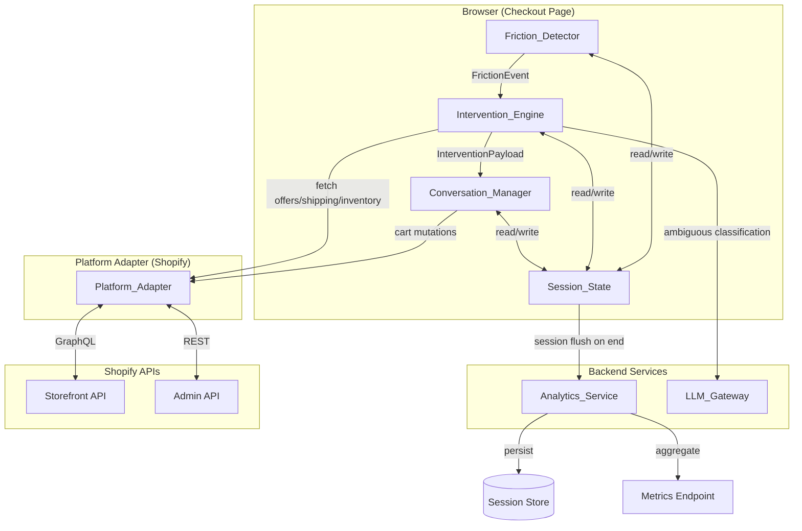
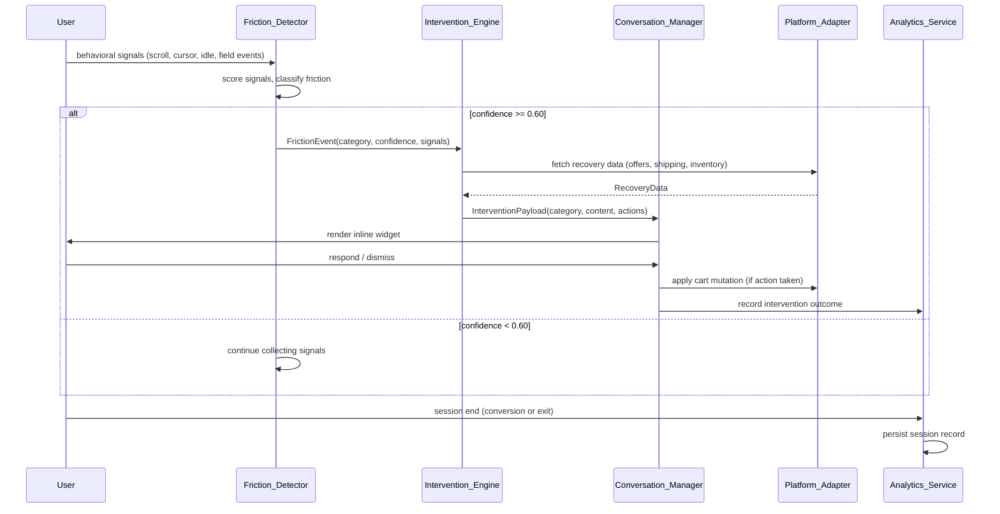
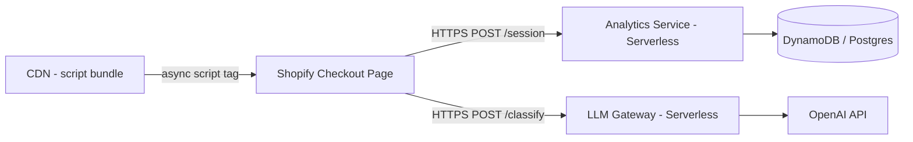

# AI-Assisted Checkout Recovery — Technical Reference

This document is the authoritative technical reference for engineers onboarding to the AI-Assisted Checkout Recovery system. It covers system architecture, component interfaces, the two-tier classification design, graceful degradation, data models, and API contracts.

---

## Table of Contents

1. [System Architecture](#1-system-architecture)
2. [Component Interfaces](#2-component-interfaces)
3. [Two-Tier Classification Design](#3-two-tier-classification-design)
4. [Graceful Degradation Hierarchy](#4-graceful-degradation-hierarchy)
5. [Data Models](#5-data-models)
6. [API Contracts](#6-api-contracts)

---

## 1. System Architecture

### 1.1 High-Level System Diagram

The system is composed of three primary browser-side runtime components (Friction_Detector, Intervention_Engine, Conversation_Manager), a shared in-memory Session_State, a thin Platform_Adapter layer that abstracts Shopify API calls, and two serverless backend services (Analytics_Service, LLM_Gateway).



### 1.2 Component Interaction Sequence

The sequence below shows the full flow from initial behavioral signal collection through friction classification, intervention delivery, user response, cart mutation, and final session flush.



### 1.3 Deployment Architecture

The system is delivered as a single IIFE JavaScript bundle served from a CDN. The bundle is injected into the Shopify checkout page via Shopify's Script Tag API. The filename includes a content hash for cache busting. The Analytics_Service and LLM_Gateway are lightweight serverless functions (AWS Lambda or Cloudflare Workers) to minimise cold-start latency.



Key deployment properties:

- **Single bundle**: All browser-side code (Friction_Detector, Intervention_Engine, Conversation_Manager, Platform_Adapter, Session_State) is compiled into one IIFE via esbuild (`esbuild.config.js`).
- **Script Tag injection**: Shopify's Script Tag API injects the bundle asynchronously so it never blocks the checkout page render.
- **Serverless functions**: `functions/analytics-service/index.ts` and `functions/llm-gateway/index.ts` are each independently deployable. Both expose a standard Web API `Request`/`Response` interface plus an AWS Lambda adapter.
- **Database**: Analytics_Service supports DynamoDB (default) or Postgres, selected via the `DB_PROVIDER` environment variable.

---

## 2. Component Interfaces

All types below are defined in `src/types/index.ts` and `src/types/weights.ts`. The interfaces here are reproduced verbatim for reference.

### 2.1 FrictionDetector

```typescript
interface FrictionDetector {
  /** Start observing the checkout page. Must be called once on page load. */
  start(config: DetectorConfig): void;

  /** Stop observing and clean up all event listeners. */
  stop(): void;

  /** Register a callback invoked when a FrictionEvent is ready. */
  onFrictionEvent(handler: (event: FrictionEvent) => void): void;
}
```

### 2.2 InterventionEngine

```typescript
interface InterventionEngine {
  /**
   * Process a FrictionEvent and produce an InterventionPayload,
   * or null if no action is appropriate.
   */
  resolve(event: FrictionEvent, session: SessionState): Promise<InterventionPayload | null>;
}
```

### 2.3 ConversationManager

```typescript
interface ConversationManager {
  /** Mount the widget into the checkout DOM. */
  mount(container: HTMLElement): void;

  /** Display an intervention. Replaces any currently active intervention. */
  show(payload: InterventionPayload): void;

  /** Programmatically dismiss the active intervention. */
  dismiss(reason: DismissReason): void;

  /** Register a callback for user action events. */
  onAction(handler: (action: UserAction) => void): void;
}
```

### 2.4 PlatformAdapter

```typescript
interface PlatformAdapter {
  /** Fetch applicable coupons/promotions for the current cart. */
  getApplicableOffers(cartId: string): Promise<Offer[]>;

  /** Fetch shipping options for a given postal code. */
  getShippingOptions(cartId: string, postalCode: string): Promise<ShippingOption[]>;

  /** Fetch size guide and inventory for a product variant. */
  getSizeGuide(productId: string): Promise<SizeGuide>;

  /** Fetch accepted payment methods for the current checkout. */
  getPaymentMethods(checkoutId: string): Promise<PaymentMethod[]>;

  /** Apply a coupon code to the cart. */
  applyCoupon(cartId: string, couponCode: string): Promise<CartUpdateResult>;

  /** Update the selected shipping option. */
  selectShipping(checkoutId: string, shippingHandle: string): Promise<CartUpdateResult>;

  /** Update a cart line item to a different variant. */
  updateVariant(cartId: string, lineItemId: string, variantId: string): Promise<CartUpdateResult>;

  /** Pre-select a payment method. */
  selectPaymentMethod(checkoutId: string, methodId: string): Promise<CartUpdateResult>;
}
```

### 2.5 AnalyticsService

```typescript
interface AnalyticsService {
  /** Persist a completed session record. Called client-side via beacon or fetch. */
  recordSession(record: SessionRecord): Promise<void>;

  /** Return aggregated metrics for a date range. */
  getMetrics(query: MetricsQuery): Promise<MetricsResult>;
}
```

### 2.6 Key Config Types

```typescript
interface DetectorConfig {
  /** Minimum confidence score required to trigger an intervention. Default: 0.60 */
  confidenceThreshold: number;
  /** Milliseconds of inactivity before idleDetected is set. Default: 30_000 */
  idleTimeoutMs: number;
  /** Pixels from the top of the viewport that trigger exit-intent. Default: 20 */
  exitIntentMarginPx: number;
  /** Maximum milliseconds allowed for classification before suppression. Default: 2_000 */
  classificationTimeoutMs: number;
}

interface FrictionEvent {
  sessionId: string;
  category: FrictionCategory;
  confidence: number;        // 0.0 – 1.0
  signals: SignalSnapshot;
  detectedAt: number;        // Unix timestamp ms
}

type FrictionCategory =
  | 'Price_Hesitation'
  | 'Shipping_Confusion'
  | 'Trust_Issue'
  | 'Missing_Information'
  | 'Coupon_Confusion'
  | 'Size_Uncertainty'
  | 'Delivery_Timeline'
  | 'Payment_Options';

interface SignalSnapshot {
  timeOnPageMs: number;
  scrollDepthPct: number;            // 0–100
  cursorVelocityAvg: number;         // px/ms
  exitIntentDetected: boolean;
  idleDetected: boolean;
  fieldEvents: FieldEvent[];
  backNavigationAttempted: boolean;
  checkoutStep: CheckoutStep;
}

interface FieldEvent {
  fieldId: string;
  eventType: 'focus' | 'blur' | 'change' | 'error';
  durationMs?: number;               // time between focus and blur
  errorMessage?: string;
}

type CheckoutStep = 'cart' | 'information' | 'shipping' | 'payment' | 'review';
```

### 2.7 Payload Types

```typescript
interface InterventionPayload {
  interventionId: string;
  category: FrictionCategory;
  recoveryAction: RecoveryActionType;
  content: InterventionContent;
  expiresAt: number;                 // Unix timestamp ms; auto-dismiss after timeout
}

interface InterventionContent {
  headline: string;
  body: string;
  actions: ActionButton[];
  supplementalData?: Record<string, unknown>;  // coupon codes, shipping options, etc.
}

interface ActionButton {
  label: string;
  actionType:
    | 'apply_coupon'
    | 'select_shipping'
    | 'select_variant'
    | 'select_payment'
    | 'dismiss'
    | 'expand_detail';
  payload?: unknown;
}

type RecoveryActionType =
  | 'show_coupon'
  | 'show_price_comparison'
  | 'show_shipping_options'
  | 'show_trust_signals'
  | 'show_size_guide'
  | 'show_payment_options'
  | 'highlight_missing_fields'
  | 'show_delivery_estimate';

interface UserAction {
  interventionId: string;
  actionType: ActionButton['actionType'];
  payload?: unknown;
  timestamp: number;
}

type DismissReason = 'user_dismissed' | 'step_completed' | 'timeout' | 'engine_error';
```

---

## 3. Two-Tier Classification Design

Friction classification uses a two-tier approach. The deterministic rule engine (Tier 1) handles the majority of sessions with zero latency and zero cost. The LLM-assisted classifier (Tier 2) handles ambiguous multi-signal cases where the rule engine cannot confidently distinguish between two competing categories.

### 3.1 Tier 1: Deterministic Rule Engine

The rule engine runs entirely in the browser with no network calls. It is the primary classification path and covers approximately 80% of sessions.

**Algorithm:**

1. For each of the eight `FrictionCategory` values, compute a weighted sum of the normalised signal values using the `SignalWeightMap` for that category.
2. Normalise all category scores to the range `[0, 1]`.
3. Sort categories by score descending. The top-scoring category is the candidate.
4. Check two conditions:
   - **Confidence threshold**: top score ≥ 0.60
   - **Ambiguity gap**: top score − second score ≥ 0.15
5. If both conditions are met → emit a `FrictionEvent` with the top category.
6. If the confidence threshold is met but the gap is < 0.15 (ambiguous) → escalate to Tier 2.
7. If the confidence threshold is not met → continue collecting signals.

**Pseudocode / signature:**

```typescript
function classifyDeterministic(
  signals: SignalSnapshot,
  weights: SignalWeightMap,
): ClassificationResult {
  const scores: Partial<Record<FrictionCategory, number>> = {};

  for (const category of ALL_FRICTION_CATEGORIES) {
    scores[category] = computeWeightedScore(signals, weights[category]);
  }

  const sorted = Object.entries(scores).sort(([, a], [, b]) => b - a);
  const [topCategory, topScore] = sorted[0];
  const [, secondScore] = sorted[1] ?? [null, 0];

  return {
    category: topCategory as FrictionCategory,
    confidence: topScore,
    isAmbiguous: topScore - secondScore < 0.15,
    allScores: scores,
  };
}
```

**Signal weight configuration** (`src/types/weights.ts`):

Weights are defined per category in `DEFAULT_WEIGHTS`. Weights within each category sum to 1.0. The table below summarises the dominant signals per category:

| Category | Dominant Signal(s) | Weight |
|---|---|---|
| Price_Hesitation | exitIntentDetected | 0.35 |
| Shipping_Confusion | fieldEvents | 0.40 |
| Trust_Issue | exitIntentDetected | 0.35 |
| Missing_Information | fieldEvents | 0.60 |
| Coupon_Confusion | fieldEvents | 0.50 |
| Size_Uncertainty | backNavigationAttempted, scrollDepthPct | 0.30 each |
| Delivery_Timeline | scrollDepthPct | 0.30 |
| Payment_Options | exitIntentDetected | 0.35 |

Weights are tunable configuration — they are not hardcoded in the classifier logic. Pass a custom `SignalWeightMap` to `classifyDeterministic` to override defaults.

### 3.2 Tier 2: LLM-Assisted Classification

Tier 2 is invoked only when Tier 1 produces an ambiguous result (gap < 0.15 between the top two categories). It makes a single HTTPS call to the LLM_Gateway serverless function.

**When Tier 2 is invoked:**
- Tier 1 result is ambiguous (top two categories within 0.15 of each other)
- Covers approximately 20% of sessions

**Prompt structure** (sent to the LLM_Gateway, which forwards to OpenAI):

```
You are a checkout friction classifier. Given the following behavioral signals from a user on a checkout page, classify the PRIMARY reason they are hesitating. Respond with ONLY a JSON object — no markdown, no explanation outside the JSON.

Signals:
- Time on page: {timeOnPageMs}ms
- Scroll depth: {scrollDepthPct}%
- Exit intent detected: {exitIntentDetected}
- Idle detected: {idleDetected}
- Back navigation attempted: {backNavigationAttempted}
- Field events: {fieldEventsSummary}
- Checkout step: {checkoutStep}
- Top deterministic scores: {topTwoCategories[0]}, {topTwoCategories[1]}

Valid categories: Price_Hesitation, Shipping_Confusion, Trust_Issue, Missing_Information,
                  Coupon_Confusion, Size_Uncertainty, Delivery_Timeline, Payment_Options

Respond with exactly this JSON shape:
{"category": "<one of the valid categories above>", "confidence": <number between 0.0 and 1.0>, "reasoning": "<one sentence>"}
```

**Timeout**: 2 seconds (`LLM_TIMEOUT_MS = 2_000`). Enforced via `AbortController`.

**Failure handling**: If the LLM call fails, times out, or returns an unparseable or out-of-range response, the gateway returns `{ category: null, confidence: 0 }`. The Intervention_Engine then falls back to the Tier 1 result if its confidence ≥ 0.60, or suppresses the intervention entirely.

### 3.3 Boundary Summary

```
Browser (synchronous, no network):
  └── Signal Collection (DOM events)
  └── Tier 1: Deterministic Classifier
        └── If unambiguous AND confidence ≥ 0.60 → trigger intervention
        └── If ambiguous → call LLM Gateway (async)

LLM Gateway (serverless, ~200ms):
  └── Tier 2: LLM Classification
        └── If confidence ≥ 0.60 → trigger intervention
        └── If still below threshold → suppress intervention

Intervention_Engine (browser, async):
  └── Fetch recovery data from Platform_Adapter
  └── Assemble InterventionPayload
  └── Hand off to Conversation_Manager
```

---

## 4. Graceful Degradation Hierarchy

The system is designed to be purely additive. It never wraps or intercepts the checkout form submission. At every degradation level the checkout form remains fully functional.

### 4.1 Degradation Levels

| Level | Condition | Behavior |
|---|---|---|
| **0 — Normal** | All components healthy | Full system active: signal collection, classification, interventions, analytics |
| **1 — LLM down** | LLM_Gateway unreachable or timed out | Deterministic-only classification; ambiguous cases fall back to Tier 1 result if confidence ≥ 0.60, otherwise suppressed |
| **2 — Platform_Adapter degraded** | Circuit breaker open; Shopify API returning 4xx/5xx | Interventions suppressed for affected categories; other categories unaffected |
| **3 — Intervention_Engine down** | Engine fails to resolve within 3 seconds | No interventions triggered; checkout proceeds normally |
| **4 — Conversation_Manager down** | Widget render error caught by error boundary | Widget suppressed; failure logged silently; no user-visible impact |
| **5 — Full system failure** | Any unrecoverable top-level error | Checkout proceeds exactly as without the system; no user-visible impact |

### 4.2 Circuit Breaker Pattern

The Intervention_Engine wraps all Platform_Adapter calls with a `CircuitBreaker` instance (`src/engine/CircuitBreaker.ts`).

**Parameters:**

| Parameter | Value |
|---|---|
| Failure threshold | 3 consecutive failures |
| Failure window | 60 seconds |
| Open duration | 30 seconds |
| Half-open probe | 1 call allowed after open duration elapses |

**State machine:**

- **Closed** (normal): calls pass through. On failure, increment `failureCount`. If `failureCount >= 3` within the 60-second window, transition to **open**.
- **Open**: all calls are rejected immediately with an error (no network call made). After `nextRetryAt` elapses, transition to **half-open**.
- **Half-open**: one probe call is allowed through. On success → **closed** (reset counters). On failure → **open** (reset `nextRetryAt`).

```typescript
interface CircuitBreakerState {
  status: 'closed' | 'open' | 'half-open';
  failureCount: number;      // consecutive failures in current window
  lastFailureAt: number;     // Unix timestamp ms of most recent failure
  nextRetryAt: number;       // Unix timestamp ms after which a probe is allowed
}
```

### 4.3 Failure Modes Table

| Failure Mode | Detection | Response | User Impact |
|---|---|---|---|
| Signal collection error (DOM exception) | `try/catch` in event listeners | Log error, continue session without signals | No intervention; checkout unaffected |
| Classification timeout (> 2s) | `AbortController` timeout | Suppress intervention | No intervention; checkout unaffected |
| LLM Gateway unreachable | `fetch` error / timeout | Use Tier 1 result if confidence ≥ 0.60, else suppress | Possible missed intervention |
| LLM returns invalid JSON | `JSON.parse` exception | Use Tier 1 result if confidence ≥ 0.60, else suppress | Possible missed intervention |
| Platform_Adapter API error | HTTP 4xx/5xx (`PlatformError`) | Suppress intervention for that category | No intervention; checkout unaffected |
| Intervention_Engine timeout (> 3s) | `AbortController` timeout | Dismiss pending intervention | No intervention; checkout unaffected |
| Conversation_Manager render error | React error boundary | Suppress widget, log silently | No intervention; checkout unaffected |
| Analytics_Service unreachable | `fetch` error on session flush | Retry once with exponential backoff; drop if still failing | Session not recorded; checkout unaffected |
| Shopify cart mutation failure | HTTP error from Platform_Adapter | Show inline error in widget; do not close widget | User sees inline error; can retry or dismiss |

---

## 5. Data Models

### 5.1 SessionState (in-memory, client-side)

`SessionState` lives entirely in browser memory. It is never persisted directly. On session end it is serialised into a `SessionRecord` and flushed to the Analytics_Service.

```typescript
interface SessionState {
  /** UUID v4 generated on page load. */
  sessionId: string;
  /** Unix timestamp (ms) when the session started. */
  startedAt: number;
  /** The checkout step the user is currently on. */
  checkoutStep: CheckoutStep;
  /** The Shopify cart GID. */
  cartId: string;
  /** All friction events detected in this session. */
  frictionEvents: FrictionEvent[];
  /** All interventions triggered in this session. */
  interventions: InterventionRecord[];
  /** Whether the session ended in a completed order. */
  converted: boolean;
  /** Unix timestamp (ms) when the session ended, if it has ended. */
  endedAt?: number;
}
```

### 5.2 SessionRecord (persisted, server-side)

`SessionRecord` is the serialised form sent to the Analytics_Service. Timestamps are ISO 8601 strings for JSON serialisation. No PII fields are present.

```typescript
interface SessionRecord {
  sessionId: string;
  /** Shopify shop domain (e.g., "my-store.myshopify.com"). */
  platformId: string;
  startedAt: string;                 // ISO 8601
  endedAt: string;                   // ISO 8601
  checkoutStepReached: CheckoutStep;
  frictionEvents: Array<{
    category: FrictionCategory;
    confidence: number;
    detectedAt: string;              // ISO 8601
  }>;
  interventions: Array<{
    interventionId: string;
    category: FrictionCategory;
    recoveryAction: RecoveryActionType;
    triggeredAt: string;             // ISO 8601
    outcome: 'accepted' | 'dismissed' | 'timed_out';
  }>;
  converted: boolean;
}
```

### 5.3 InterventionRecord

`InterventionRecord` is the in-memory outcome record for a single intervention within a session. It is embedded in `SessionState.interventions` and serialised into `SessionRecord.interventions` on flush.

```typescript
interface InterventionRecord {
  interventionId: string;
  category: FrictionCategory;
  /** Unix timestamp (ms) when the intervention was shown. */
  triggeredAt: number;
  outcome: 'accepted' | 'dismissed' | 'timed_out' | 'pending';
  /** Unix timestamp (ms) when the outcome was recorded. */
  resolvedAt?: number;
}
```

### 5.4 SignalWeightMap and DEFAULT_WEIGHTS

`SignalWeightMap` maps each `FrictionCategory` to a partial set of `SignalSnapshot` keys and their weights. Weights within a category must sum to 1.0.

```typescript
type SignalWeightMap = Record<
  FrictionCategory,
  Partial<Record<keyof SignalSnapshot, number>>
>;

const DEFAULT_WEIGHTS: SignalWeightMap = {
  Price_Hesitation: {
    timeOnPageMs: 0.30,
    scrollDepthPct: 0.15,
    exitIntentDetected: 0.35,
    idleDetected: 0.20,
  },
  Shipping_Confusion: {
    timeOnPageMs: 0.20,
    fieldEvents: 0.40,
    scrollDepthPct: 0.15,
    exitIntentDetected: 0.25,
  },
  Trust_Issue: {
    scrollDepthPct: 0.25,
    exitIntentDetected: 0.35,
    idleDetected: 0.20,
    backNavigationAttempted: 0.20,
  },
  Missing_Information: {
    fieldEvents: 0.60,
    timeOnPageMs: 0.20,
    idleDetected: 0.20,
  },
  Coupon_Confusion: {
    fieldEvents: 0.50,
    timeOnPageMs: 0.25,
    idleDetected: 0.15,
    exitIntentDetected: 0.10,
  },
  Size_Uncertainty: {
    scrollDepthPct: 0.30,
    idleDetected: 0.25,
    backNavigationAttempted: 0.30,
    timeOnPageMs: 0.15,
  },
  Delivery_Timeline: {
    scrollDepthPct: 0.30,
    fieldEvents: 0.25,
    exitIntentDetected: 0.25,
    idleDetected: 0.20,
  },
  Payment_Options: {
    exitIntentDetected: 0.35,
    fieldEvents: 0.30,
    idleDetected: 0.20,
    timeOnPageMs: 0.15,
  },
};
```

### 5.5 CircuitBreakerState

```typescript
interface CircuitBreakerState {
  status: 'closed' | 'open' | 'half-open';
  /** Number of consecutive failures in the current 60-second window. */
  failureCount: number;
  /** Unix timestamp (ms) of the most recent failure. */
  lastFailureAt: number;
  /** Unix timestamp (ms) after which a probe call is allowed. */
  nextRetryAt: number;
}
```

---

## 6. API Contracts

### 6.1 LLM Gateway

**Endpoint:** `POST /classify`

**Purpose:** Tier 2 friction classification. Called by the browser-side Intervention_Engine when the deterministic classifier produces an ambiguous result.

**Request body:**

```json
{
  "signals": {
    "timeOnPageMs": 45000,
    "scrollDepthPct": 62,
    "cursorVelocityAvg": 0.4,
    "exitIntentDetected": true,
    "idleDetected": false,
    "fieldEvents": [
      { "fieldId": "shipping-method", "eventType": "focus", "durationMs": 1200 }
    ],
    "backNavigationAttempted": false,
    "checkoutStep": "shipping"
  },
  "topTwoCategories": ["Shipping_Confusion", "Price_Hesitation"]
}
```

| Field | Type | Description |
|---|---|---|
| `signals` | `SignalSnapshot` | Full signal snapshot from the current session |
| `topTwoCategories` | `[string, string]` | The two highest-scoring categories from the deterministic classifier, in descending score order |

**Response body (success):**

```json
{
  "category": "Shipping_Confusion",
  "confidence": 0.82,
  "reasoning": "User focused on the shipping method field for over a second and has exit intent, suggesting confusion about shipping options."
}
```

| Field | Type | Description |
|---|---|---|
| `category` | `FrictionCategory \| null` | Classified category, or `null` on any failure |
| `confidence` | `number` | Confidence score in `[0.0, 1.0]`, or `0` on failure |
| `reasoning` | `string` | One-sentence explanation from the model (omitted on failure) |

**Timeout behavior:** The gateway enforces a 2-second hard timeout on the OpenAI call via `AbortController`. On timeout, network error, invalid JSON, or out-of-range confidence, the gateway returns HTTP 200 with `{ "category": null, "confidence": 0 }`. The caller must never treat a non-null HTTP status as the only failure signal.

**Error responses:**

| Status | Condition |
|---|---|
| `400` | Request body is missing, not valid JSON, or structurally invalid |
| `405` | Non-POST method |
| `200` with `category: null` | LLM call failed, timed out, or returned unparseable output |

---

### 6.2 Analytics Service

#### POST /session

**Purpose:** Persist a completed session record. Called client-side via `fetch` (or `navigator.sendBeacon` for tab-close scenarios) when a session ends.

**Request body:** A `SessionRecord` object.

```json
{
  "sessionId": "550e8400-e29b-41d4-a716-446655440000",
  "platformId": "my-store.myshopify.com",
  "startedAt": "2024-03-15T10:23:00.000Z",
  "endedAt": "2024-03-15T10:31:45.000Z",
  "checkoutStepReached": "payment",
  "frictionEvents": [
    {
      "category": "Price_Hesitation",
      "confidence": 0.74,
      "detectedAt": "2024-03-15T10:27:12.000Z"
    }
  ],
  "interventions": [
    {
      "interventionId": "a1b2c3d4-e5f6-7890-abcd-ef1234567890",
      "category": "Price_Hesitation",
      "recoveryAction": "show_coupon",
      "triggeredAt": "2024-03-15T10:27:13.000Z",
      "outcome": "accepted"
    }
  ],
  "converted": true
}
```

**Validation rules:**

- `sessionId`, `platformId`, `startedAt`, `endedAt` — required non-empty strings
- `startedAt`, `endedAt` — must be valid ISO 8601 date strings
- `checkoutStepReached` — must be one of: `cart`, `information`, `shipping`, `payment`, `review`
- `converted` — must be a boolean
- `frictionEvents[].category` — must be one of the eight `FrictionCategory` values
- `frictionEvents[].confidence` — must be a number in `[0, 1]`
- `frictionEvents[].detectedAt` — must be a valid ISO 8601 date string
- `interventions[].outcome` — must be one of: `accepted`, `dismissed`, `timed_out`

**Response (success):**

```json
{ "ok": true, "sessionId": "550e8400-e29b-41d4-a716-446655440000" }
```

HTTP status: `201 Created`

**Timeout behavior:** The persist operation is bounded by a 5-second hard timeout. If the database write does not complete within 5 seconds, the service returns HTTP 500 with `{ "error": "Persist timed out" }`.

**Error responses:**

| Status | Condition |
|---|---|
| `400` | Body is not valid JSON, or fails validation |
| `500` | Database write failed or timed out |

---

#### GET /metrics

**Purpose:** Return aggregated conversion and intervention metrics for a configurable date range.

**Query parameters:**

| Parameter | Type | Required | Description |
|---|---|---|---|
| `startDate` | ISO 8601 string | Yes | Inclusive start of the reporting period |
| `endDate` | ISO 8601 string | Yes | Inclusive end of the reporting period |
| `frictionCategory` | `FrictionCategory` | No | Filter results to sessions containing this category |

**Example request:**

```
GET /metrics?startDate=2024-03-01&endDate=2024-03-31&frictionCategory=Price_Hesitation
```

**Response body (`MetricsResult`):**

```json
{
  "conversionRate": 4.2,
  "baselineConversionRate": 2.5,
  "deltaPercentagePoints": 1.7,
  "interventionAcceptanceRate": 61.3,
  "perCategoryRecoveryRate": {
    "Price_Hesitation": 68.0,
    "Shipping_Confusion": 55.0,
    "Trust_Issue": 42.0,
    "Missing_Information": 71.0,
    "Coupon_Confusion": 59.0,
    "Size_Uncertainty": 48.0,
    "Delivery_Timeline": 53.0,
    "Payment_Options": 44.0
  },
  "totalSessions": 1240,
  "totalInterventions": 387
}
```

| Field | Type | Description |
|---|---|---|
| `conversionRate` | `number` | `(converted / total) * 100` |
| `baselineConversionRate` | `number` | Historical baseline from `BASELINE_CONVERSION_RATE` env var |
| `deltaPercentagePoints` | `number` | `conversionRate − baselineConversionRate` |
| `interventionAcceptanceRate` | `number` | `(accepted / total interventions) * 100` |
| `perCategoryRecoveryRate` | `Record<FrictionCategory, number>` | Per-category `(accepted / triggered) * 100` |
| `totalSessions` | `number` | Total sessions in the reporting period |
| `totalInterventions` | `number` | Total interventions triggered in the reporting period |

**Error responses:**

| Status | Condition |
|---|---|
| `400` | Missing or invalid `startDate`/`endDate`; invalid `frictionCategory` value |
| `500` | Database query failed |

---

### 6.3 Shopify Storefront API Calls

All Storefront API calls are made from the browser via `ShopifyAdapter` (`src/platform/ShopifyAdapter.ts`). The endpoint is `https://{shopDomain}/api/{apiVersion}/graphql.json` with the `X-Shopify-Storefront-Access-Token` header.

#### cartDiscountCodesUpdate

Used by `applyCoupon()` to apply a discount code to the cart.

```graphql
mutation CartDiscountCodesUpdate($cartId: ID!, $discountCodes: [String!]!) {
  cartDiscountCodesUpdate(cartId: $cartId, discountCodes: $discountCodes) {
    cart {
      id
      discountCodes { code applicable }
      cost { totalAmount { amount currencyCode } }
    }
    userErrors { field message }
  }
}
```

#### checkoutShippingLineUpdate

Used by `selectShipping()` to apply a shipping rate selection to the checkout.

```graphql
mutation CheckoutShippingLineUpdate($checkoutId: ID!, $shippingRateHandle: String!) {
  checkoutShippingLineUpdate(checkoutId: $checkoutId, shippingRateHandle: $shippingRateHandle) {
    checkout {
      id
      totalPriceV2 { amount currencyCode }
    }
    checkoutUserErrors { field message }
  }
}
```

#### cartLinesUpdate

Used by `updateVariant()` to swap a cart line item to a different product variant.

```graphql
mutation CartLinesUpdate($cartId: ID!, $lines: [CartLineUpdateInput!]!) {
  cartLinesUpdate(cartId: $cartId, lines: $lines) {
    cart {
      id
      cost { totalAmount { amount currencyCode } }
    }
    userErrors { field message }
  }
}
```

Variables: `lines` is an array of `{ id: lineItemId, merchandiseId: variantId }`.

#### checkoutAttributesUpdateV2 (payment method pre-selection)

Used by `selectPaymentMethod()` to store the user's payment method preference as a custom attribute on the checkout. The checkout page reads this attribute to pre-select the appropriate payment UI.

```graphql
mutation CheckoutAttributesUpdate($checkoutId: ID!, $input: CheckoutAttributesUpdateV2Input!) {
  checkoutAttributesUpdateV2(checkoutId: $checkoutId, input: $input) {
    checkout {
      id
      totalPriceV2 { amount currencyCode }
    }
    checkoutUserErrors { field message }
  }
}
```

Variables: `input.customAttributes = [{ key: "selected_payment_method", value: methodId }]`

#### Shipping rates query

Used by `getShippingOptions()` to retrieve available shipping rates for a checkout.

```graphql
query GetCheckoutShippingRates($checkoutId: ID!) {
  node(id: $checkoutId) {
    ... on Checkout {
      availableShippingRates {
        ready
        shippingRates {
          handle
          title
          priceV2 { amount currencyCode }
        }
      }
    }
  }
}
```

Results are sorted by `minDeliveryDays` ascending (fastest first) before being returned.

#### Product metafields and variants query

Used by `getSizeGuide()` to retrieve size guide data and variant inventory for a product.

```graphql
query GetSizeGuide($productId: ID!) {
  product(id: $productId) {
    id
    title
    metafields(identifiers: [
      { namespace: "size_guide", key: "entries" },
      { namespace: "size_guide", key: "guide_url" }
    ]) {
      namespace
      key
      value
    }
    variants(first: 50) {
      edges {
        node {
          id
          title
          availableForSale
          quantityAvailable
        }
      }
    }
  }
}
```

Size guide entries are stored as a JSON array in the `size_guide.entries` metafield. The `guide_url` metafield is optional.

#### Payment gateways query

Used by `getPaymentMethods()` to retrieve accepted card brands from the shop's payment settings.

```graphql
query GetPaymentGateways {
  shop {
    paymentSettings {
      acceptedCardBrands
    }
  }
}
```

The adapter supplements the card brands with a fixed list of common digital wallets (Shop Pay, PayPal, Apple Pay, Google Pay).

---

### 6.4 Shopify Admin API Calls

Admin API calls are made server-side (or from a trusted context) via `ShopifyAdapter`. The base URL is `https://{shopDomain}/admin/api/{apiVersion}` with the `X-Shopify-Access-Token` header.

#### Discount codes query

Used by `getApplicableOffers()` to retrieve active price rules and their discount codes.

**Step 1 — Fetch active price rules:**

```
GET /price_rules.json?status=enabled&limit=250
```

Response shape:
```json
{
  "price_rules": [
    {
      "id": 123456,
      "title": "Summer Sale",
      "value_type": "percentage",
      "value": "-10.0",
      "starts_at": "2024-06-01T00:00:00Z",
      "ends_at": "2024-08-31T23:59:59Z"
    }
  ]
}
```

The adapter filters to rules where `starts_at <= now` and (`ends_at` is null or `ends_at > now`). Up to 10 active rules are processed.

**Step 2 — Fetch discount codes per rule (parallel):**

```
GET /price_rules/{price_rule_id}/discount_codes.json
```

Response shape:
```json
{
  "discount_codes": [
    { "id": 789, "code": "SUMMER10", "usage_count": 42, "price_rule_id": 123456 }
  ]
}
```

The first discount code for each rule is used to construct an `Offer` object. The `discountAmount` is normalised: percentage rules divide by 100 (e.g., `10.0%` → `0.10`); fixed-amount rules use the absolute value.

---

*End of Technical Reference*
